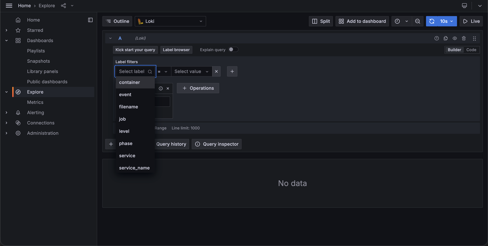
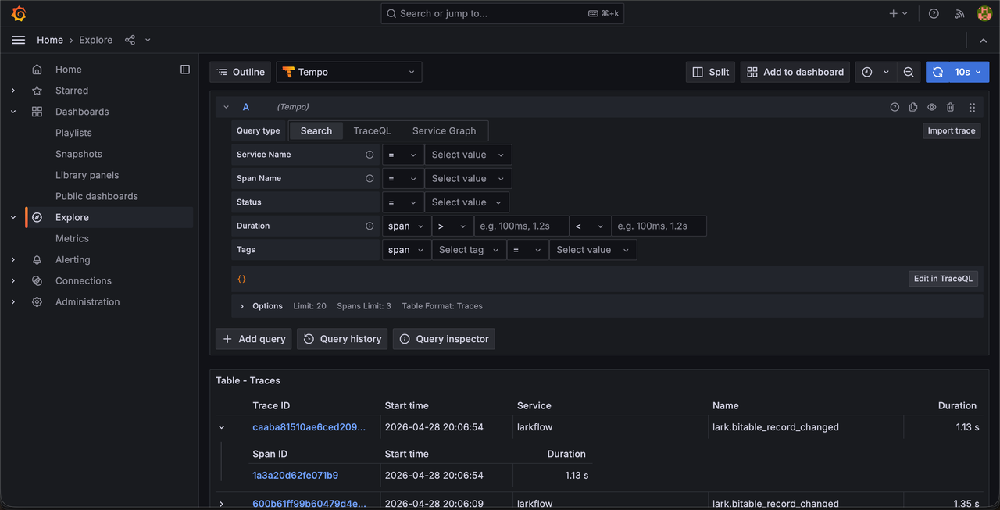
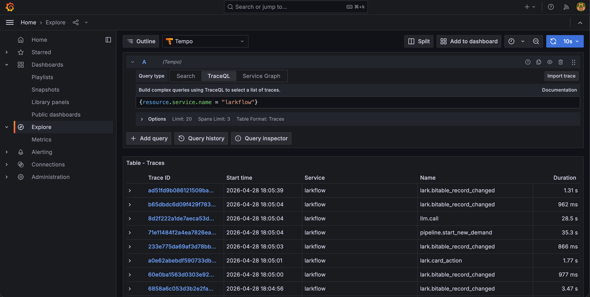
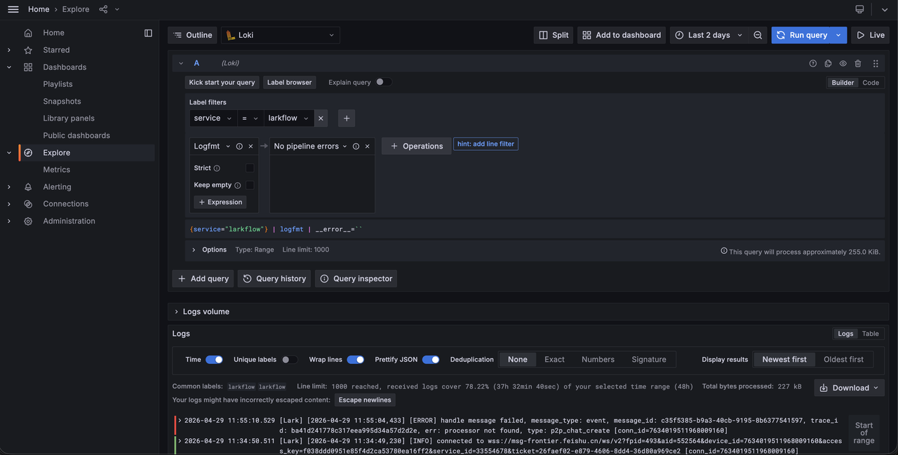
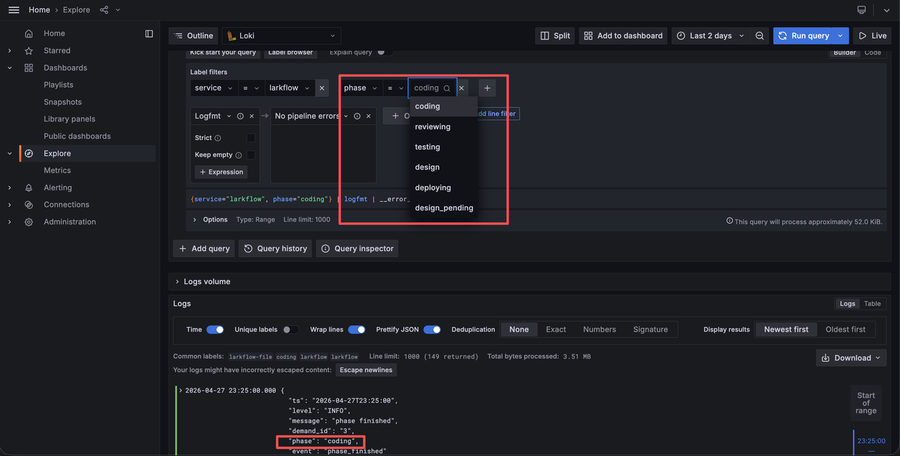
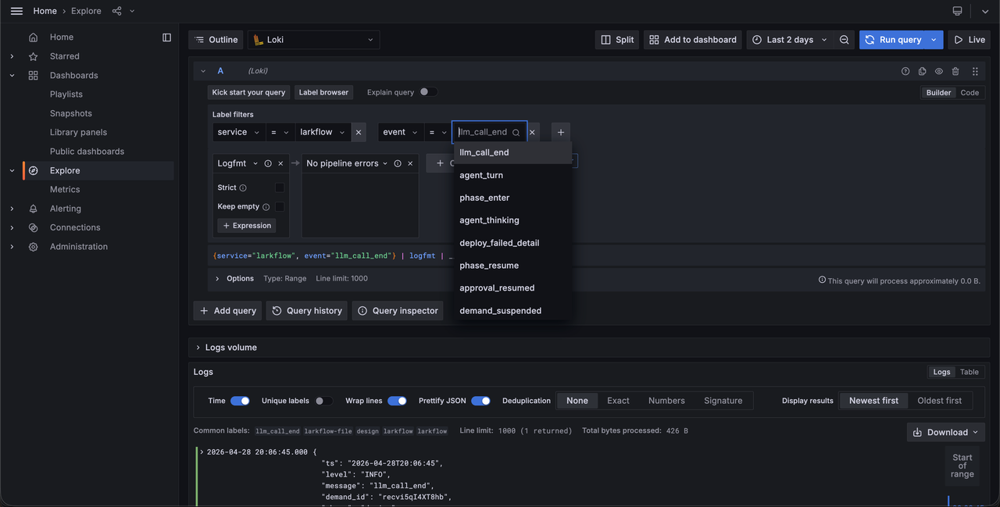
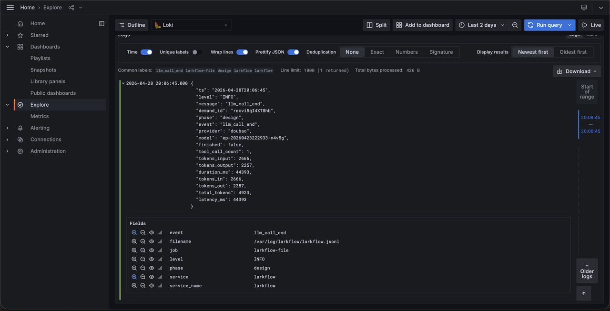
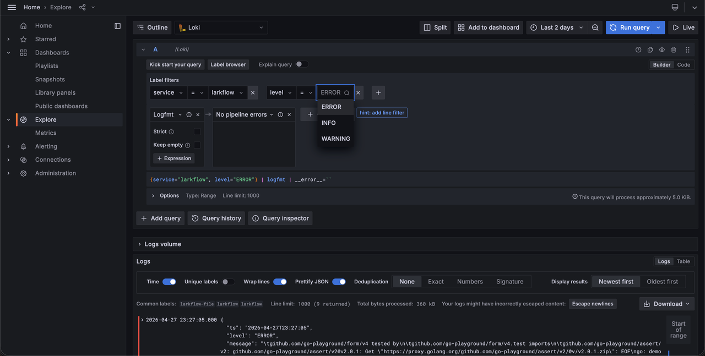

# Larkflow - Grafana介绍

## 1. 功能概述

LarkFlow 的 Grafana 用于集中展示 Pipeline 运行过程中的可观测性数据，帮助开发者和维护人员快速了解需求处理流程的执行状态，并定位运行中的异常问题。

当前 Grafana 主要承载以下能力：

- 展示 Pipeline 各阶段的运行状态
- 查看链路追踪信息（Trace）
- 查看结构化运行日志
- 观察 LLM 调用情况
- 辅助定位失败、重试、卡顿等问题

通过 Grafana，LarkFlow 的运行过程不再是黑盒，而是一个可观察、可分析、可排查的问题定位界面。

## 2. 使用方式

启动本地观测栈后，可在浏览器中访问 Grafana 页面，进入 Explore 查看日志。

## 3. 配置说明

### 3.1 配置信息

具体位置：

`LarkFlow/templates/kratos-skeleton/otel/docker-compose.yml`

```yaml
grafana:
  image: grafana/grafana:11.0.0
  environment:
    GF_SECURITY_ADMIN_USER: admin
    GF_SECURITY_ADMIN_PASSWORD: admin
  volumes:
    - ./grafana/provisioning:/etc/grafana/provisioning:ro
  depends_on:
    - prometheus
    - tempo
    - loki
  ports:
    - "3000:3000"
```

默认访问地址：`http://localhost:3000`

说明：

- 默认账号密码：`admin / admin`
- 启动时会自动加载 `grafana/provisioning` 下的配置
- 当前只自动注入了数据源，没有预置 dashboard

### 3.2 启动说明

#### 1. 启动观测栈

```bash
cd /Users/tao/PyCharmProject/LarkFlow/demo-app/otel
docker compose -f docker-compose.yml up -d --build
```

#### 2. 启动 LarkFlow

按这种方式启动后，日志不会再输出到终端，而是输出到 Grafana 中。

```bash
cd /Users/tao/PyCharmProject/LarkFlow/LarkFlow
source venv/bin/activate
PYTHONPATH=. PYTHONUNBUFFERED=1 python -m pipeline.lark_interaction >> logs/lark_listener.log 2>&1
```

#### 3. 打开 Grafana

- 地址：`http://localhost:3000`
- 账号：`admin`
- 密码：`admin`

## 4. 数据说明

### 4.1 Trace / Metrics 数据

来自 OpenTelemetry 链路，用于展示：

- Pipeline 执行阶段
- 阶段耗时
- LLM 调用时长
- 工具调用过程
- 关键链路追踪信息

### 4.2 日志数据

来自结构化日志文件和运行日志，用于展示：

- Pipeline 运行日志
- 飞书交互日志
- LLM 调用日志
- 重试、失败、异常日志

## 5. Explore 功能与操作说明

### 5.1 Explore 是做什么的

Grafana 的 Explore 主要用于做即时查询和问题排查，可以用于查看某个需求的详细日志、按字段快速过滤运行数据、从日志或链路中定位具体异常等内容。

进入 Grafana 后，在左侧菜单中选择 Explore，可以选择不同的数据源进行查询。当前常用的是：

- `Loki`：查看结构化日志
- `Tempo`：查看 Trace 链路

### 5.2 在 Explore 中查看日志

#### 5.2.1 Loki

选择数据源为 Loki 后，可以对 LarkFlow 的结构化日志进行查询。当前日志中常见的关键字段包括：

- `demand_id`：当前日志所属的需求 ID，用于唯一标识一次需求处理流程。
- `phase`：当前日志发生时所在的流程阶段，用于表示这条日志属于哪个处理环节。目前阶段包括 `design`、`design_pending`、`coding`、`testing`、`reviewing`、`deploying`。
- `event`：当前发生的事件类型，用于描述这条日志记录的具体动作或状态变化。例如模型调用开始、模型调用结束、重试、工具执行、阶段取消等。
- `provider`：当前使用的大模型提供方，用于标识本次调用来自哪个 LLM Provider。目前取值包括 `anthropic`、`openai`、`qwen`、`doubao`。
- `model`：当前实际调用的模型名称，用于进一步区分同一个 Provider 下的具体模型配置。
- `tool_name`：当前涉及的工具名称。当日志与工具调用相关时，该字段用于说明调用的是哪个工具，例如 `inspect_db`、`file_editor`、`run_bash`。
- `tokens_input`：当前模型调用消耗的输入 token 数量，表示发送给模型的提示词、上下文、历史消息等输入内容规模。
- `tokens_output`：当前模型调用产生的输出 token 数量，表示模型本轮返回内容的规模。
- `duration_ms`：当前事件或调用的执行耗时，单位为毫秒。通常用于表示模型调用时长、工具执行时长或某个关键动作的耗时。



#### 5.2.2 Tempo

Tempo 中有三种常见的链路查看方式：

- `Search`：最基础的 Trace 查询方式，用来根据已知条件查找某一批链路数据。通常可以按时间范围、时长范围、标签字段、`service.name`、span 名称等信息搜索。

    
- `TraceQL`：按条件筛选 Trace，适合更精细地查找 Trace。需要输入 TraceQL 查询语句来查看符合条件的 Trace 列表。例如，想看 `larkflow` 服务的日志，查询语句可以写：

    ```traceql
    {resource.service.name = "larkflow"}
    ```
    

更多查询语句可参考：

- https://grafana.com/docs/tempo/latest/traceql/construct-traceql-queries/
- https://grafana.com/docs/grafana/latest/datasources/tempo/query-editor/traceql-query-examples/

- `Service Graph`：用来展示服务之间调用关系的视图。通常用于查看上游入口和下游服务之间的依赖关系，以及是否存在预期外的调用路径。

### 5.3 常见查询方式

#### 5.3.1 查询某个服务的全部日志

在 `service` 中选择对应的服务。



#### 5.3.2 查询某个阶段的日志

在 `phase` 中选择需要查询的阶段。



#### 5.3.3 查询 LLM 调用完成事件

查看模型调用结束后的 `token`、耗时、`provider`、`model` 信息。





#### 5.3.4 查询某个服务中的错误日志

将 `level` 的条件设置为 `ERROR`。



## 6. 总结

LarkFlow 的 Grafana 主要用于把 Pipeline 的运行状态、阶段耗时、模型调用、工具调用和结构化日志统一展示出来，帮助开发者快速理解系统运行过程，并在出现问题时快速定位问题位置。
