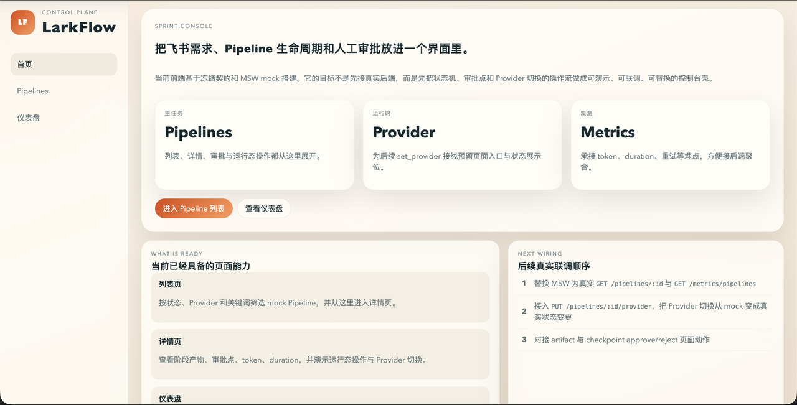
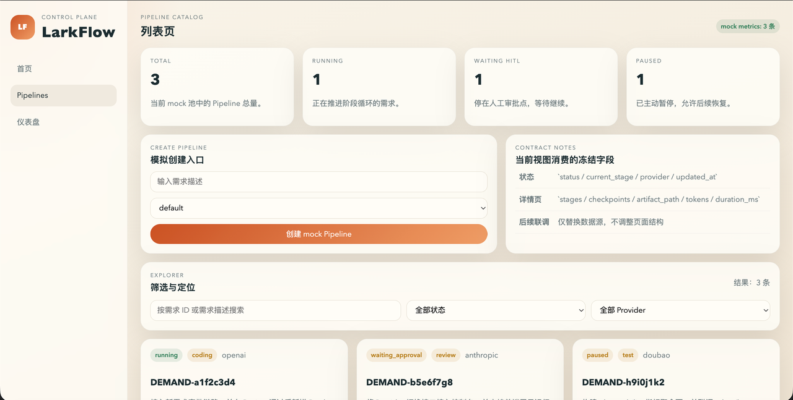
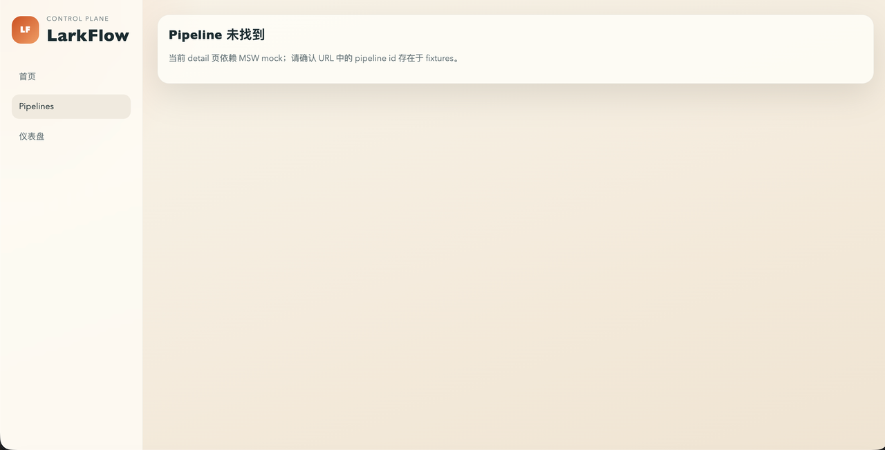
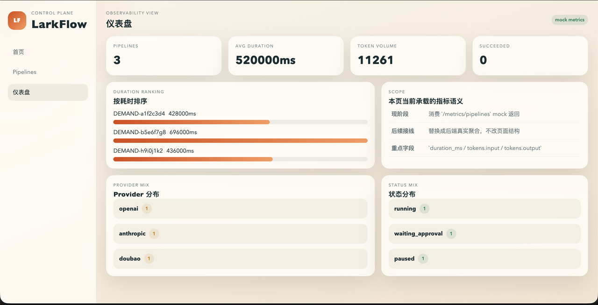

# Larkflow - 前端说明文档

## 1. 简介

代码位于项目中的 `LarkFlow/frontend/` 目录下。当前前端控制台已支持真实 API 与 `MSW mock` 双模式运行。

- 真实 API 模式：用于与后端 REST 控制面联调
- `MSW mock` 模式：用于在后端未启动时独立演示页面结构与交互

开发态下，如果未配置 `VITE_API_BASE_URL`，前端默认启用 `MSW`；显式设置 `VITE_USE_MSW=0` 且配置 `VITE_API_BASE_URL` 时，前端会请求真实后端。

当前实现基于以下技术栈：

- `Vite`
- `React 18`
- `TypeScript`
- `react-router-dom`
- `MSW`

开始前，请确认本机已安装 `Node.js` 以及 `npm`。建议先执行以下命令确认环境可用：

```bash
node -v
npm -v
```

如果命令无法执行，请先完成 `Node.js` 环境安装，再继续后续步骤。

## 2. 首次启动

### 2.1 进入前端目录

```bash
cd LarkFlow/frontend
```

### 2.2 安装依赖

该命令用于安装 `package.json` 中定义的全部前端依赖。

```bash
npm install
```

### 2.3 初始化 MSW Worker

该命令用于生成浏览器侧 `mockServiceWorker.js` 文件。  
这是 `MSW` 生效的必要步骤，仅在首次初始化或该文件被删除后需要重新执行。

```bash
npx msw init public/ --save
```

### 2.4 启动开发服务器

```bash
npm run dev
```

启动成功后，终端中将显示本地访问地址。当前默认地址为：`http://localhost:4173`

### 2.5 切换到真实 API

如果要联调真实后端，请使用：

```bash
VITE_USE_MSW=0 VITE_API_BASE_URL=http://localhost:8000 npm run dev
```

如果只使用 mock：

```bash
VITE_USE_MSW=1 npm run dev
```

## 3. 日常启动

如果已经完成过依赖安装和 `MSW` 初始化，后续日常开发只需要执行：

```bash
cd LarkFlow/frontend
npm run dev
```

## 4. 页面访问入口

前端启动后，可访问以下页面：

- `http://localhost:4173/`
  首页，用于说明当前控制台能力和后续联调方向

  

- `http://localhost:4173/pipelines`
  Pipeline 列表页，支持创建 Pipeline、搜索、状态筛选、Provider 筛选
  
  

- `http://localhost:4173/pipelines/DEMAND-a1f2c3d4`
  Pipeline 详情页，支持状态切换、Provider 切换、checkpoint approve/reject、artifact 预览
  
  

- `http://localhost:4173/dashboard`
  仪表盘页，展示指标汇总、状态分布、Provider 分布和耗时排名
  
  
