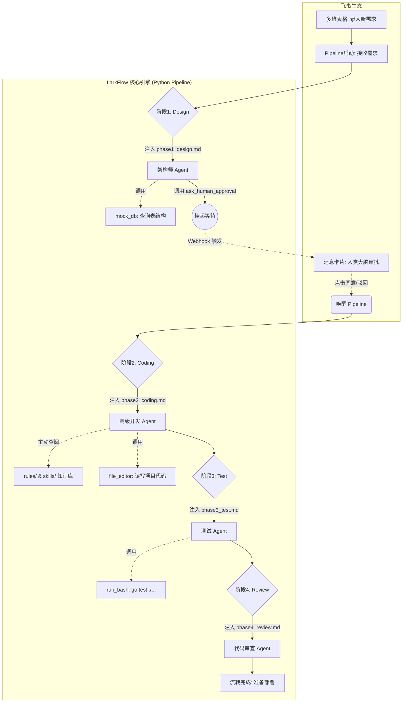

# LarkFlow Framework v1.0

LarkFlow 已经从一个依赖本地 IDE 插件的工具，进化为一个**完全无头（Headless）、基于多智能体（Multi-Agent）协作的自动化研发工作流引擎**。

[](https://github.com/your-repo/larkflow)
[](#architecture)

## 🚀 核心架构演进 (v1.0)

> **Pipeline 是骨架，Agent 是肌肉，人类是大脑**

在 v1.0 版本中，我们实现一个**通用的、API 驱动的开源 Go 后端研发助手**。
代码已经具备以下主干能力：
- 支持 `Anthropic` 和 `OpenAI` 两种 LLM Provider。
- 通过四阶段 Agent Prompt 驱动需求设计、编码、测试和审查。
- 通过飞书交互卡片挂起审批，再由 Webhook 恢复流程。
- 能把设计规范拆分为 `rules/` 和 `skills/`，让编码 Agent 按需读取。
- 在流程结束后，默认尝试对 `demo-app/` 执行 Docker 构建和启动。

### 1. 整体流转架构



### 2. 目录结构

```text
.
├── README.md
├── LarkFlow/
│   ├── .env.example
│   ├── requirements.txt
│   ├── Dockerfile
│   ├── LarkFlow.md
│   ├── agents/
│   │   ├── phase1_design.md
│   │   ├── phase2_coding.md
│   │   ├── phase3_test.md
│   │   ├── phase4_review.md
│   │   └── tools_definition.md
│   ├── pipeline/
│   │   ├── engine.py
│   │   ├── lark_client.py
│   │   ├── lark_interaction.py
│   │   ├── llm_adapter.py
│   │   ├── tools_schema.py
│   │   └── utils/lark_doc.py
│   ├── rules/
│   └── skills/
└── demo-app/
    ├── main.go
    ├── go.mod
    ├── internal/
    └── db/migrations/
```

## LarkFlow 引擎结构

### 1. Agents

`LarkFlow/agents/` 里定义了四个阶段的 System Prompt：

- `phase1_design.md`：系统设计与审批前方案输出。
- `phase2_coding.md`：按 `rules/` 和 `skills/` 实现 Go 代码。
- `phase3_test.md`：补测试并运行验证。
- `phase4_review.md`：从规范角度复查并修正问题。

### 2. Rules 和 Skills

这部分是编码 Agent 的“检索式规范库”：

- `rules/flow-rule.md`：总规则，要求先查路由表再编码。
- `rules/skill-routing.md`：按数据库、Redis、HTTP、错误处理、并发等关键词，把任务映射到具体 skill。
- `skills/*.md`：团队约束和最佳实践，例如 SQL 注入防护、统一 JSON 响应、错误包装、并发安全。

### 3. Pipeline

`LarkFlow/pipeline/engine.py` 负责主状态机和工具执行：

- 通过 `start_new_demand()` 启动一个新需求。
- 在设计阶段调用 `ask_human_approval` 后挂起。
- 收到审批回调后，进入 Coding、Test、Review 阶段。
- 最后默认对仓库根下的 `demo-app/` 尝试构建 Docker 镜像并运行。

`LarkFlow/pipeline/llm_adapter.py` 统一了两类模型调用：

- `Anthropic Messages API`
- `OpenAI Responses API`

`LarkFlow/pipeline/lark_interaction.py` 提供 FastAPI Webhook 服务，负责：

- 接收飞书卡片按钮点击
- 接收“开始执行”这类 HTTP 触发
- 读取飞书文档链接内容
- 唤醒已挂起的 Pipeline

## 快速开始

### 1. 环境准备

确保你已经安装了 Python 3.9+，并配置了可用的 LLM API Key（Anthropic 或 OpenAI）。

```bash
# 克隆仓库
git clone https://github.com/your-repo/larkflow.git
cd larkflow

# 创建虚拟环境
python3 -m venv venv
source venv/bin/activate

# 安装依赖
pip install -r requirements.txt
```

### 2. 配置环境变量

在 `LarkFlow/` 目录下创建 `.env` 文件（可参考 `.env.example`）：

```env
LLM_PROVIDER=anthropic
LARK_WEBHOOK_URL=https://open.feishu.cn/open-apis/bot/v2/hook/...

# 飞书应用机器人 (Bot API)
LARK_APP_ID=cli_xxx
LARK_APP_SECRET=xxx
LARK_CHAT_ID=ou_xxx

# Claude / Anthropic
ANTHROPIC_API_KEY=sk-ant-api03-...
ANTHROPIC_AUTH_TOKEN=
ANTHROPIC_BASE_URL=
ANTHROPIC_MODEL=claude-sonnet-4-6

# Codex / OpenAI
OPENAI_API_KEY=sk-...
OPENAI_BASE_URL=https://api.openai.com/v1
OPENAI_MODEL=gpt-5-codex
OPENAI_REASONING_EFFORT=medium
```

- 当 `LLM_PROVIDER=anthropic` 时，Pipeline 使用 Claude / Anthropic SDK。
- 当 `LLM_PROVIDER=openai` 时，Pipeline 使用 OpenAI Responses API。

### 3. 运行

启动 FastAPI 服务来接收真实的飞书 Webhook：

```bash
uvicorn pipeline.lark_interaction:app --host 0.0.0.0 --port 8000
```

飞书webhook可以使用ngrok隧道地址；

配置飞书机器人（事件和回调），并开通相关权限（表格，消息等）；

通过飞书表格即可启动需求：


### 4.简单测试

简单测试：你可以直接运行引擎脚本来模拟一个需求的完整生命周期：（不会向飞书发送技术方案卡片）

```bash
python pipeline/engine.py
```

---

## 核心特性：按需检索 (RAG) 知识库

LarkFlow v1.0 最精华的知识库架构。AI 在写代码前，会强制读取 `rules/skill-routing.md` 路由表。

例如，当需求包含“Redis 缓存”时，AI 会自动调用 `file_editor` 工具读取 `skills/redis.md`，学习团队规定的 Pipeline 批量操作和过期时间规范，从而写出完全符合团队标准的代码。这极大地降低了 Token 消耗并消除了 AI 幻觉。

---

## 已知问题

按当前代码状态，以下问题仍然存在：

- `mock_db` 只返回固定文本，设计阶段不能依赖它做真实 schema 判断。
- `file_editor` 的文档与工具 schema 提到了 `replace`，但当前 `engine.py` 运行时并没有实现这个动作。
- `LarkFlow/Dockerfile` 里的启动命令仍然没有对齐当前 FastAPI 入口，容器化运行前需要先修正。

## 相关文档

- `LarkFlow/LarkFlow.md`：引擎模块速览。
- `LarkFlow/CHANGELOG.md`：版本变更记录。
- `LarkFlow/LOCAL_ISSUES_TRACKER.md`：本地问题跟踪，含部分历史结论，阅读时要以当前代码为准。

## 🔮 未来展望

本框架具备极强的可扩展性与业务适应能力：
- **规范无缝迁移**：未来可轻松接入并适配各公司内部的专属中间件规范与代码风格指南。
- **基建深度打通**：支持通过内部 MCP (Model Context Protocol) 协议，直连生产/测试环境的数据库、缓存及配置中心。
- **CI/CD 自动化闭环**：可直接对接自动化部署流水线，实现测试环境的一键部署，并将详尽的自动化测试报告与运行效果实时回传至飞书卡片。
- **加入业务规则代码**：轻松加入业务规则代码，更加简单的写业务