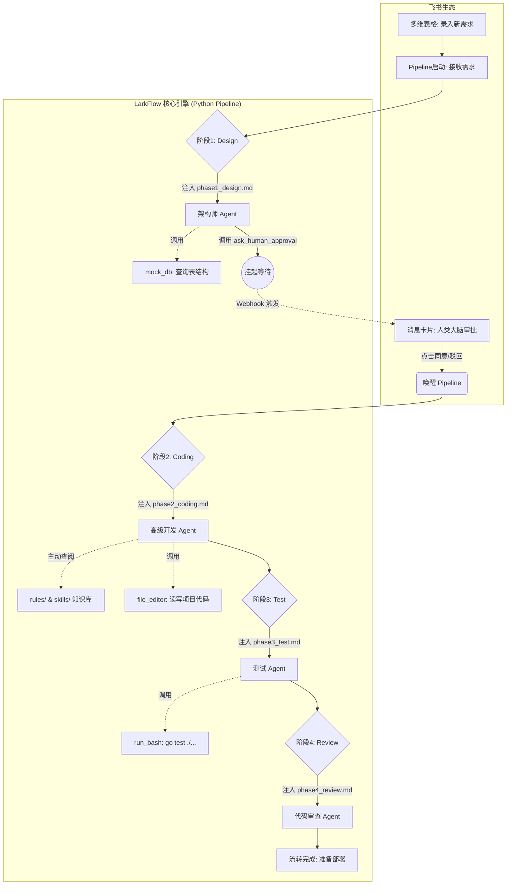

# LarkFlow Framework v1.0

LarkFlow 已经从一个依赖本地 IDE 插件的工具，进化为一个**完全无头（Headless）、基于多智能体（Multi-Agent）协作的自动化研发工作流引擎**。

[](https://github.com/your-repo/larkflow)
[](#architecture)

## 🚀 核心架构演进 (v1.0)

> **Pipeline 是骨架，Agent 是肌肉，人类是大脑**

在 v1.0 版本中，我们实现一个**通用的、API 驱动的开源 Go 后端研发助手**。

### 1. 整体流转架构



---

## 目录结构

```text
.                         # 仓库根目录
├── demo-app/             # 🎯 由 LarkFlow 自动生成的示例 Go 工程
│   └── go.mod            #    可直接编译运行，完全符合 skills/ 中定义的代码规范
└── LarkFlow/             # ⚙️ LarkFlow 工作流引擎本体
    ├── agents/           # 🧠 智能体定义 (架构师、程序员、测试员、审查员的 System Prompt)
    │   ├── phase1_design.md
    │   ├── phase2_coding.md
    │   ├── phase3_test.md
    │   ├── phase4_review.md
    │   └── tools_definition.md
    ├── pipeline/         # 调度引擎 (Python 状态机)
    │   ├── engine.py     # 核心状态机 (触发 -> 挂起 -> 唤醒)
    │   ├── lark_interaction.py # 飞书卡片构建与 Webhook 接收
    │   ├── llm_adapter.py  # Anthropic / OpenAI 统一适配层
    │   └── tools_schema.py     # Anthropic / OpenAI 的工具 JSON Schema
    ├── rules/            # 🚦 规则路由 (AI 查阅规范的总入口)
    │   ├── flow-rule.md  # 最高准则
    │   └── skill-routing.md    # 关键词路由表 (RAG 核心)
    └── skills/           # 📚 通用领域知识库 (Go 最佳实践)
        ├── database.md   # GORM / SQL 防注入规范
        ├── redis.md      # go-redis / 过期时间规范
        ├── http.md       # Gin / 标准 JSON 响应规范
        ├── error.md      # 错误包装与 Sentinel Errors
        └── concurrency.md # goroutine 安全规范
```

---

## 快速开始

### 1. 环境准备

确保你已经安装了 Python 3.9+，并配置了可用的 LLM API Key（Anthropic 或 OpenAI）。

```bash
# 克隆仓库
git clone https://github.com/your-repo/larkflow.git
cd larkflow

# 创建虚拟环境
python3 -m venv venv
source venv/bin/activate

# 安装依赖
pip install -r requirements.txt
```

### 2. 配置环境变量

在 `LarkFlow/` 目录下创建 `.env` 文件（可参考 `.env.example`）：

```env
LLM_PROVIDER=anthropic
LARK_WEBHOOK_URL=https://open.feishu.cn/open-apis/bot/v2/hook/...

# 飞书应用机器人 (Bot API)
LARK_APP_ID=cli_xxx
LARK_APP_SECRET=xxx
LARK_CHAT_ID=ou_xxx

# Claude / Anthropic
ANTHROPIC_API_KEY=sk-ant-api03-...
ANTHROPIC_AUTH_TOKEN=
ANTHROPIC_BASE_URL=
ANTHROPIC_MODEL=claude-sonnet-4-6

# Codex / OpenAI
OPENAI_API_KEY=sk-...
OPENAI_BASE_URL=https://api.openai.com/v1
OPENAI_MODEL=gpt-5-codex
OPENAI_REASONING_EFFORT=medium
```

- 当 `LLM_PROVIDER=anthropic` 时，Pipeline 使用 Claude / Anthropic SDK。
- 当 `LLM_PROVIDER=openai` 时，Pipeline 使用 OpenAI Responses API。

### 3. 运行 Pipeline

你可以直接运行引擎脚本来模拟一个需求的完整生命周期：

```bash
python pipeline/engine.py
```

或者启动 FastAPI 服务来接收真实的飞书 Webhook：

```bash
uvicorn pipeline.lark_interaction:app --host 0.0.0.0 --port 8000
```

---

## 核心特性：按需检索 (RAG) 知识库

LarkFlow v1.0 最精华的知识库架构。AI 在写代码前，会强制读取 `rules/skill-routing.md` 路由表。

例如，当需求包含“Redis 缓存”时，AI 会自动调用 `file_editor` 工具读取 `skills/redis.md`，学习团队规定的 Pipeline 批量操作和过期时间规范，从而写出完全符合团队标准的代码。这极大地降低了 Token 消耗并消除了 AI 幻觉。

---

## 🔮 未来展望

本框架具备极强的可扩展性与业务适应能力：
- **规范无缝迁移**：未来可轻松接入并适配各公司内部的专属中间件规范与代码风格指南。
- **基建深度打通**：支持通过内部 MCP (Model Context Protocol) 协议，直连生产/测试环境的数据库、缓存及配置中心。
- **CI/CD 自动化闭环**：可直接对接自动化部署流水线，实现测试环境的一键部署，并将详尽的自动化测试报告与运行效果实时回传至飞书卡片。
- **加入业务规则代码**：轻松加入业务规则代码，更加简单的写业务
